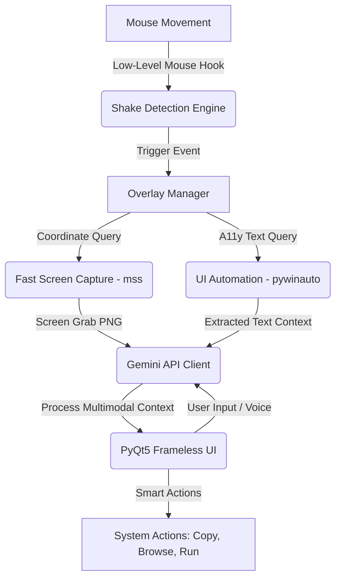

# Magisor 🪄

[](https://www.python.org/)
[](https://www.microsoft.com/windows)
[](https://www.riverbankcomputing.com/software/pyqt/)
[](https://aistudio.google.com/)
[](LICENSE)

Magisor is an AI-powered, context-aware cursor overlay utility for Windows. Running unobtrusively in the system tray, it monitors mouse gestures and invokes a stunning glassmorphic UI overlay at your cursor position when a "shake" gesture is detected or a hotkey is triggered. 

Behind the scenes, Magisor captures the visual context surrounding the cursor, queries Windows UI Automation to extract accessibility text under the pointer, and feeds this multimodal context to the Google Gemini Vision API. This allows you to instantly ask follow-up questions, run smart actions (like copying text, opening links, and writing files), and interact intelligently with any program on your screen.

---

## 🔮 System Architecture



---

## 🚀 Key Features

* **Global Shake Gesture Detection:** Responsive gesture engine utilizing high-performance, low-level Win32 mouse hooks.
* **Multimodal Context Merging:** Fuses dynamic screenshot bounding boxes with rich text extracted directly from the Windows Accessibility Tree (UI Automation).
* **Gemini 2.0 Vision Integration:** Highly structured prompt tuning using Google's fastest vision models.
* **Premium Glassmorphic UI:** A frameless PyQt5 interface with smooth layout transitions, localized animations, and voice support.
* **Contextual Actions:** Automatically parses elements (e.g. URLs, code snippets, textual data) to execute copy-to-clipboard, launch browser, or run scripts.
* **Privacy & Local Isolation:** All configurations and API keys are stored strictly locally in `%APPDATA%/Magisor/settings.json`. No external telemetry.

---

## ⚙️ Prerequisites & Get a Gemini API Key

Magisor runs entirely on your local machine and communicates directly with Google's API servers. You will need your own Google Gemini API key to run it.

1. Navigate to the [Google AI Studio Console](https://aistudio.google.com/).
2. Log in with your Google account.
3. Click **Get API key** in the left sidebar, then click **Create API key**.
4. Copy the generated key (it starts with `AIzaSy...`).
5. Paste this key into Magisor's onboarding wizard upon first launch, or update it later via the **Settings** menu in the system tray.

---

## 💻 Installation & Developer Setup

### Running from Source

1. **Clone the Repository:**
   ```bash
   git clone https://github.com/vinamrapandey/Magisor.git
   cd Magisor
   ```

2. **Create and Activate a Virtual Environment:**
   ```powershell
   python -m venv venv
   .\venv\Scripts\activate
   ```

3. **Install Dependencies:**
   ```bash
   pip install -r requirements.txt
   ```

4. **Launch the Application:**
   ```bash
   python main.py
   ```

---

## 📦 Project Structure

```text
/magisor
  ├── main.py              # Main runner and application initialization
  ├── mouse_hook.py        # Win32 low-level mouse hooks and gesture tracking
  ├── capture.py           # Multi-monitor visual screen-grab manager (mss)
  ├── ai_client.py         # Google Gemini API client wrapper
  ├── overlay.py           # Borderless PyQt5 glassmorphic UI overlay
  ├── onboarding.py        # First-launch configuration setup wizard
  ├── tray.py              # System tray integration and context menu
  ├── context_reader.py    # Windows UI Automation text-grabber (pywinauto)
  ├── actions.py           # Context-specific action executor (copy, open link)
  ├── config.py            # Local JSON settings manager (reads/writes settings.json)
  ├── env_manager.py       # Local .env parser & validator
  ├── requirements.txt     # Python module dependencies
  ├── magisor_installer.nsi# NSIS script for compiling the Windows installer
  └── assets/              # Icons, status GIFs, and user interface media
```

---

## ⚙️ Advanced Configuration

You can configure system behavior and runtime environments using a `.env` file in the project root:

| Environment Variable | Description | Default Value |
| :--- | :--- | :--- |
| `MAGISOR_ENV` | Running mode (`development` or `production`) | `production` |
| `LOG_LEVEL` | Verbosity level for file logging (`DEBUG`, `INFO`, `WARNING`, `ERROR`) | `INFO` |
| `GEMINI_MODEL` | The specific model identifier to query via API | `gemini-2.0-flash` |

### Settings File Location
User settings (such as the verified API key and launch options) are saved inside a JSON file:
```text
%APPDATA%\Magisor\settings.json
```
If you need to completely reset the application or clear your configuration, simply delete this directory.

---

## 🛠️ Compilation & Packaging Guide

Magisor is packaged into a single standalone executable and wrapped in an NSIS Installer for easy distribution.

### 1. Build Executable with PyInstaller
Ensure PyInstaller is installed (`pip install pyinstaller`), then run:
```bash
pyinstaller Magisor.spec
```
This reads the specifications inside `Magisor.spec` and compiles the project into `dist/Magisor/Magisor.exe`, bundling all assets.

### 2. Generate Windows Setup Installer
Ensure [NSIS (Nullsoft Scriptable Install System)](https://nsis.sourceforge.io/) is installed and added to your system path. Compile the installer script by running:
```powershell
makensis magisor_installer.nsi
```
This will compile a standalone installer:
```text
dist/Magisor Setup 1.0.exe
```

---

## 🔍 Troubleshooting Matrix

| Issue | Root Cause | Solution |
| :--- | :--- | :--- |
| **Overlay is offset or blurry** | High-DPI Display Scaling mismatch | Right-click `Magisor.exe` $\rightarrow$ **Properties** $\rightarrow$ **Compatibility** $\rightarrow$ **Change high DPI settings** $\rightarrow$ Check "Override high DPI scaling behavior" and select "Application". |
| **Shake gesture does not work in task managers or terminal windows** | Privilege Elevation Mismatch | Windows restricts low-level hooks from executing on Admin/System windows when the hook program has standard privileges. To fix, right-click Magisor and choose **Run as Administrator**. |
| **"404 Model Not Found" error** | Deprecated model reference or API change | Modify the model string in your local `.env` file (e.g., set `GEMINI_MODEL=gemini-2.0-flash` or the latest active version). |
| **Black screen captures in multi-monitor setups** | Virtual coordinate mapping boundaries | Magisor handles multi-monitor coordinates using `mss`. Ensure your primary monitor is set correctly in Windows Display settings. |
| **Hotkeys / hooks not firing** | Antivirus false positive | Some anti-malware programs flag low-level keyboard/mouse hooks as keyloggers. Add `Magisor.exe` to your whitelist. |

---

## 📄 License

This project is licensed under the MIT License - see the [LICENSE](LICENSE) file for details.
